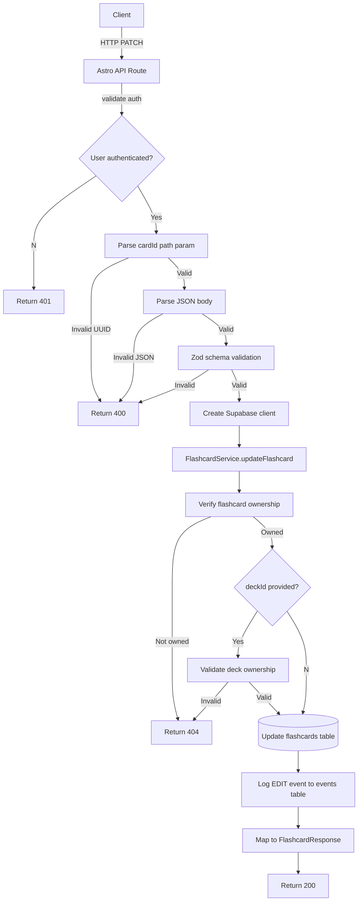

# API Endpoint Implementation Plan: Update Flashcard (PATCH /flashcards/{cardId})

## 1. Endpoint Overview

Updates an existing flashcard that belongs to the authenticated user. The endpoint supports editing the front/back text content and changing the deck assignment. This implements the "Inline Edit" functionality (FR-04/06) where users can modify flashcard content after creation. The endpoint requires at least one field to be updated and triggers an audit event for tracking changes.

## 2. Request Details

- **HTTP Method:** `PATCH`
- **URL Structure:** `/flashcards/{cardId}`
- **Path Parameters:**
  - `cardId` (uuid, required) – Identifier of the flashcard to update
- **Query Parameters:** None

### Request Body

```json
{
  "front": "Updated question text?", // optional, 1-1000 characters
  "back": "Updated answer text", // optional, 1-1000 characters
  "deckId": "uuid", // optional, null to remove from deck
  "source": "ai_edited" // optional, enum: "ai", "manual", "ai_edited"
}
```

**Parameters:**

- **Required (at least one):**
  - `front` (string): Updated front face content, 1-1000 characters
  - `back` (string): Updated back face content, 1-1000 characters
  - `deckId` (string | null): Updated deck assignment (UUID or null to remove from deck)
  - `source` (FlashcardSource): Updated source attribution

## 3. Used Types

- **Request DTO:** `UpdateFlashcardRequest` - Command model for flashcard updates
- **Response DTO:** `FlashcardResponse` - Full flashcard data including updated fields
- **Error DTO:** `ApiErrorResponse` - Standard error response format
- **Enums:** `FlashcardSource` - `"ai" | "manual" | "ai_edited"`

## 4. Response Details

| Status  | Description                                   | DTO                 |
| ------- | --------------------------------------------- | ------------------- |
| **200** | Flashcard successfully updated                | `FlashcardResponse` |
| **400** | Invalid request body or validation errors     | `ApiErrorResponse`  |
| **401** | User not authenticated                        | `ApiErrorResponse`  |
| **404** | Flashcard not found or deck reference invalid | `ApiErrorResponse`  |
| **500** | Unexpected server error                       | `ApiErrorResponse`  |

### Successful Response Example (200)

```json
{
  "id": "550e8400-e29b-41d4-a716-446655440000",
  "front": "Updated question text?",
  "back": "Updated answer text",
  "deckId": "550e8400-e29b-41d4-a716-446655440001",
  "source": "ai_edited",
  "easeFactor": 2.5,
  "intervalDays": 0,
  "repetition": 0,
  "nextReviewAt": null,
  "createdAt": "2025-10-09T12:00:00Z",
  "updatedAt": "2025-10-09T12:30:00Z",
  "userId": "550e8400-e29b-41d4-a716-446655440002",
  "deletedAt": null
}
```

## 5. Data Flow



1. **Authentication:** Middleware verifies JWT token and attaches user context to `locals.user`
2. **Path Validation:** `cardId` path parameter is validated as proper UUID format
3. **Request Parsing:** JSON body is parsed and validated against Zod schema
4. **Ownership Check:** Verify flashcard exists and is owned by authenticated user
5. **Deck Validation:** If `deckId` provided, verify deck exists, is owned by user, and not soft-deleted
6. **Service Layer:** `FlashcardService.updateFlashcard()` handles database update with optimistic locking
7. **Event Logging:** Log "EDIT" event to events table for audit trail
8. **Response:** Return 200 OK with updated flashcard data

## 6. Security Considerations

1. **Authentication:** Required - enforced by global authentication middleware via Supabase JWT
2. **Authorization:**
   - RLS policies on flashcards table ensure `user_id = auth.uid()`
   - Deck ownership validation prevents assigning flashcards to other users' decks
   - Explicit ownership check prevents unauthorized updates
3. **Input Validation:**
   - All inputs validated with Zod schemas including type coercion and length limits
   - `cardId` and `deckId` validated as proper UUID format
   - `source` enum validation prevents invalid values
   - At least one field requirement prevents empty updates
4. **SQL Injection Prevention:** Parameterized queries via Supabase SDK
5. **Optimistic Locking:** Updated timestamp prevents concurrent modification conflicts
6. **Data Privacy:** User-scoped data isolation through database RLS policies

## 7. Error Handling

- **400 Bad Request:** Invalid JSON, schema validation failures, malformed UUIDs, or no fields provided
- **401 Unauthorized:** Missing or invalid JWT token
- **404 Not Found:** Referenced flashcard doesn't exist or isn't owned by user, or deck reference invalid
- **500 Internal Server Error:** Database connection issues, unexpected exceptions, or service failures

### Error Logging Strategy

- Use `ConsoleLogger` for structured logging with consistent format
- Log validation errors with user context for debugging
- Log authentication failures for security monitoring
- Log ownership validation failures for security auditing
- Log server errors with error details for troubleshooting
- Always log successful edits for audit trail

## 8. Performance Considerations

- **Database Indexes:** Leverages existing indexes on `flashcards(id, user_id)` and `decks(id, user_id)`
- **Query Optimization:** Single UPDATE operation with no complex joins or aggregations
- **Connection Pooling:** Supabase handles connection management efficiently
- **Response Size:** Minimal response payload containing only the updated flashcard data
- **Event Logging:** Lightweight INSERT to events table for audit trail
- **Optimistic Locking:** `updated_at` timestamp prevents lost updates

## 9. Implementation Steps

### 1. Update Flashcard Validation Schemas (`src/lib/flashcards/schemas.ts`)

```typescript
import { z } from "zod";

export const flashcardIdParamsSchema = z.object({
  cardId: z.string().uuid("cardId must be a valid UUID"),
});

export const updateFlashcardBodySchema = z
  .object({
    front: z
      .string()
      .min(1, "Front content cannot be empty")
      .max(1000, "Front content must be 1000 characters or less")
      .optional(),
    back: z
      .string()
      .min(1, "Back content cannot be empty")
      .max(1000, "Back content must be 1000 characters or less")
      .optional(),
    deckId: z.union([z.string().uuid("deckId must be a valid UUID"), z.null()]).optional(),
    source: z.enum(["ai", "manual", "ai_edited"]).optional(),
  })
  .refine(
    (data) =>
      data.front !== undefined || data.back !== undefined || data.deckId !== undefined || data.source !== undefined,
    {
      message: "At least one field must be provided for update",
      path: ["front"],
    }
  );

export type FlashcardIdParams = z.infer<typeof flashcardIdParamsSchema>;
export type UpdateFlashcardBody = z.infer<typeof updateFlashcardBodySchema>;
```

### 2. Extend FlashcardService (`src/lib/services/flashcardService.ts`)

Add `updateFlashcard` method:

```typescript
async updateFlashcard(
  userId: string,
  cardId: string,
  updates: UpdateFlashcardRequest
): Promise<FlashcardResponse> {
  // First verify ownership and get current flashcard
  const { data: existingCard, error: fetchError } = await this.supabase
    .from("flashcards")
    .select("id, front, back, deck_id, source, user_id")
    .eq("id", cardId)
    .eq("user_id", userId)
    .is("deleted_at", null)
    .single();

  if (fetchError || !existingCard) {
    throw new Error("Flashcard not found or not owned by user");
  }

  // Validate deck ownership if deckId provided
  if (updates.deckId !== undefined && updates.deckId !== null) {
    const { data: deck, error: deckError } = await this.supabase
      .from("decks")
      .select("id")
      .eq("id", updates.deckId)
      .eq("user_id", userId)
      .is("deleted_at", null)
      .single();

    if (deckError || !deck) {
      throw new Error("Referenced deck does not exist or is not owned by user");
    }
  }

  // Build update payload
  const updatePayload: Record<string, unknown> = {
    updated_at: new Date().toISOString(),
  };

  if (updates.front !== undefined) updatePayload.front = updates.front;
  if (updates.back !== undefined) updatePayload.back = updates.back;
  if (updates.deckId !== undefined) updatePayload.deck_id = updates.deckId;
  if (updates.source !== undefined) updatePayload.source = updates.source;

  // Update flashcard
  const { data: updatedCard, error: updateError } = await this.supabase
    .from("flashcards")
    .update(updatePayload)
    .eq("id", cardId)
    .eq("user_id", userId)
    .select()
    .single();

  if (updateError) {
    throw updateError;
  }

  // Log edit event to audit trail
  await this.supabase.from("events").insert({
    user_id: userId,
    flashcard_id: cardId,
    action: "EDIT",
    source: existingCard.source, // Log the source at time of edit
  });

  return this.mapToFlashcardResponse(updatedCard);
}
```

### 3. Create API Route (`src/pages/api/flashcards/[cardId].ts`)

```typescript
import type { APIRoute } from "astro";
import { createSupabaseServerInstance } from "../../../../db/supabase.client";
import { FlashcardService } from "../../../../lib/services/flashcardService";
import { createErrorResponse, createJsonResponse } from "../../../../lib/utils/apiResponse";
import { ConsoleLogger } from "../../../../lib/utils/logger";
import { flashcardIdParamsSchema, updateFlashcardBodySchema } from "../../../../lib/flashcards/schemas";
import type { FlashcardResponse, UpdateFlashcardRequest, ApiErrorResponse } from "../../../../types";

export const prerender = false;

const logger = new ConsoleLogger("UpdateFlashcardApi");

export const PATCH: APIRoute = async ({ params, request, locals, cookies }) => {
  if (!locals.user) {
    logger.warn("Unauthenticated flashcard update request");
    return createErrorResponse(401, {
      code: "UNAUTHORIZED",
      message: "Authentication required",
    });
  }

  // Validate path parameters
  const pathValidation = flashcardIdParamsSchema.safeParse(params);
  if (!pathValidation.success) {
    const issues = pathValidation.error.issues.map((issue) => issue.message);
    logger.warn("Invalid cardId parameter", {
      issues,
      userId: locals.user.id,
      params,
    });
    return createErrorResponse(400, {
      code: "INVALID_CARD_ID",
      message: "cardId must be a valid UUID",
      details: issues.map((message) => ({ message })),
    });
  }

  const { cardId } = pathValidation.data;

  // Parse and validate request body
  let body: unknown;
  try {
    body = await request.json();
  } catch (error) {
    logger.warn("Invalid JSON body", {
      userId: locals.user.id,
      cardId,
      error: error instanceof Error ? error.message : "Unknown error",
    });
    return createErrorResponse(400, {
      code: "INVALID_BODY",
      message: "Request body must be valid JSON",
    });
  }

  const bodyValidation = updateFlashcardBodySchema.safeParse(body);
  if (!bodyValidation.success) {
    const issues = bodyValidation.error.issues.map((issue) => issue.message);
    logger.warn("Flashcard update validation failed", {
      issues,
      userId: locals.user.id,
      cardId,
    });
    return createErrorResponse(400, {
      code: "VALIDATION_ERROR",
      message: "Invalid flashcard update payload",
      details: issues.map((message) => ({ message })),
    });
  }

  const supabase =
    locals.supabase ??
    createSupabaseServerInstance({
      cookies,
      headers: request.headers,
    });

  const flashcardService = new FlashcardService(supabase);

  try {
    const updatedFlashcard = await flashcardService.updateFlashcard(locals.user.id, cardId, bodyValidation.data);

    logger.info("Flashcard updated", {
      userId: locals.user.id,
      cardId,
      updatedFields: Object.keys(bodyValidation.data),
    });

    return createJsonResponse<FlashcardResponse>(200, updatedFlashcard);
  } catch (error) {
    const serviceError = error as { message?: string };

    if (serviceError?.message?.includes("Flashcard not found")) {
      logger.warn("Flashcard ownership validation failed", {
        userId: locals.user.id,
        cardId,
      });
      return createErrorResponse(404, {
        code: "FLASHCARD_NOT_FOUND",
        message: "Flashcard not found or not owned by you",
      });
    }

    if (serviceError?.message?.includes("Referenced deck")) {
      logger.warn("Deck ownership validation failed", {
        userId: locals.user.id,
        cardId,
        deckId: bodyValidation.data.deckId,
      });
      return createErrorResponse(404, {
        code: "DECK_NOT_FOUND",
        message: "Referenced deck does not exist or is not owned by you",
      });
    }

    logger.error("Failed to update flashcard", {
      userId: locals.user.id,
      cardId,
      error: error instanceof Error ? error.message : "Unknown error",
    });

    return createErrorResponse(500, {
      code: "SERVER_ERROR",
      message: "Unexpected error occurred while updating flashcard",
    });
  }
};
```

### 4. Add Unit Tests

Create comprehensive tests covering:

- Schema validation for all input scenarios (valid/invalid UUIDs, field constraints, etc.)
- Service method with ownership validation and deck validation
- API route error handling and response formatting
- Authentication and authorization scenarios
- Event logging verification
- Concurrent update scenarios (optimistic locking)

### 5. Integration Testing

- End-to-end request flow with real database
- RLS policy verification for ownership
- Event logging verification
- Performance testing with concurrent requests
- Error scenario validation (non-existent cards, invalid decks, etc.)

### 6. Documentation Updates

- Update API specification document with actual request/response examples
- Add endpoint to API overview table
- Document event logging behavior for audit trail
- Update flashcard lifecycle documentation
