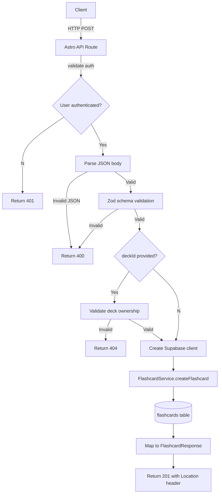

# API Endpoint Implementation Plan: Create Flashcard (POST /flashcards)

## 1. Endpoint Overview

Create a new flashcard for the authenticated user. The flashcard can be entirely generated by AI, manually created, or an edited version of AI-generated content. The endpoint supports optional deck assignment and source attribution. All flashcards are created with default SM-2 scheduling values (ease factor 2.5, interval 0 days, repetition 0, no scheduled review).

## 2. Request Details

- **HTTP Method:** `POST`
- **URL Structure:** `/flashcards`
- **Path Parameters:** None
- **Query Parameters:** None

### Request Body

```json
{
  "front": "What is the capital of France?",
  "back": "Paris",
  "deckId": "uuid", // optional
  "source": "manual" // optional, defaults to "manual"
}
```

**Parameters:**

- **Required:**
  - `front` (string): Front face content, 1-1000 characters
  - `back` (string): Back face content, 1-1000 characters

- **Optional:**
  - `deckId` (string): UUID of deck to assign the flashcard to. Must reference an existing, non-deleted deck owned by the authenticated user
  - `source` (FlashcardSource): Origin of the flashcard content. Must be one of: `"ai"`, `"manual"`, `"ai_edited"`. Defaults to `"manual"`

## 3. Used Types

- **Request DTO:** `CreateFlashcardRequest` - Command model for flashcard creation
- **Response DTO:** `FlashcardResponse` - Full flashcard data including generated fields
- **Error DTO:** `ApiErrorResponse` - Standard error response format
- **Enums:** `FlashcardSource` - `"ai" | "manual" | "ai_edited"`

## 4. Response Details

| Status  | Description                                                | DTO                 |
| ------- | ---------------------------------------------------------- | ------------------- |
| **201** | Flashcard successfully created                             | `FlashcardResponse` |
| **400** | Invalid request body or validation errors                  | `ApiErrorResponse`  |
| **401** | User not authenticated                                     | `ApiErrorResponse`  |
| **404** | Referenced deck does not exist or is not owned by the user | `ApiErrorResponse`  |
| **500** | Unexpected server error                                    | `ApiErrorResponse`  |

### Successful Response Example (201)

```json
{
  "id": "550e8400-e29b-41d4-a716-446655440000",
  "front": "What is the capital of France?",
  "back": "Paris",
  "deckId": "550e8400-e29b-41d4-a716-446655440001",
  "source": "manual",
  "easeFactor": 2.5,
  "intervalDays": 0,
  "repetition": 0,
  "nextReviewAt": null,
  "createdAt": "2025-10-09T12:00:00Z",
  "updatedAt": "2025-10-09T12:00:00Z",
  "userId": "550e8400-e29b-41d4-a716-446655440002",
  "deletedAt": null
}
```

## 5. Data Flow



1. **Authentication:** Middleware verifies JWT token and attaches user context to `locals.user`
2. **Request Parsing:** JSON body is parsed and validated against Zod schema
3. **Deck Validation:** If `deckId` provided, verify deck exists, is owned by user, and not soft-deleted
4. **Service Layer:** `FlashcardService.createFlashcard()` handles database insertion with proper defaults
5. **Response:** Return 201 Created with Location header pointing to the new flashcard

## 6. Security Considerations

1. **Authentication:** Required - enforced by global authentication middleware via Supabase JWT
2. **Authorization:**
   - RLS policies on flashcards table ensure `user_id = auth.uid()`
   - Deck ownership validation prevents assigning flashcards to other users' decks
   - No cross-user data access possible
3. **Input Validation:**
   - All inputs validated with Zod schemas including type coercion and length limits
   - `deckId` validated as proper UUID format and ownership
   - `source` enum validation prevents invalid values
   - Content length limits prevent oversized data
4. **SQL Injection Prevention:** Parameterized queries via Supabase SDK
5. **Rate Limiting:** Consider implementing rate limiting for flashcard creation (similar to deck creation)
6. **Data Privacy:** User-scoped data isolation through database RLS policies

## 7. Error Handling

- **400 Bad Request:** Invalid JSON, schema validation failures, or malformed parameters
- **401 Unauthorized:** Missing or invalid JWT token
- **404 Not Found:** Referenced deck doesn't exist or isn't owned by the authenticated user
- **500 Internal Server Error:** Database connection issues, unexpected exceptions, or service failures

### Error Logging Strategy

- Use `ConsoleLogger` for structured logging with consistent format
- Log validation errors with user context for debugging
- Log authentication failures for security monitoring
- Log server errors with error details for troubleshooting
- Consider adding error events to audit trail for critical failures

## 8. Performance Considerations

- **Database Indexes:** Leverages existing indexes on `flashcards(user_id)` and `flashcards(deck_id)`
- **Query Optimization:** Single INSERT operation with no complex joins or aggregations
- **Connection Pooling:** Supabase handles connection management efficiently
- **Response Size:** Minimal response payload containing only the created flashcard data
- **Rate Limiting:** Implement sliding window rate limiter (similar to deck creation) to prevent abuse

## 9. Implementation Steps

### 1. Create Flashcard Validation Schemas (`src/lib/flashcards/schemas.ts`)

```typescript
import { z } from "zod";

export const createFlashcardBodySchema = z.object({
  front: z.string().min(1).max(1000, "Front content must be 1000 characters or less"),
  back: z.string().min(1).max(1000, "Back content must be 1000 characters or less"),
  deckId: z.string().uuid().optional(),
  source: z.enum(["ai", "manual", "ai_edited"]).default("manual"),
});

export type CreateFlashcardBody = z.infer<typeof createFlashcardBodySchema>;
```

### 2. Extend FlashcardService (`src/lib/services/flashcardService.ts`)

Add `createFlashcard` method:

```typescript
async createFlashcard(
  userId: string,
  data: CreateFlashcardRequest
): Promise<FlashcardResponse> {
  // Validate deck ownership if deckId provided
  if (data.deckId) {
    const { data: deck, error: deckError } = await this.supabase
      .from("decks")
      .select("id")
      .eq("id", data.deckId)
      .eq("user_id", userId)
      .is("deleted_at", null)
      .single();

    if (deckError || !deck) {
      throw new Error("Deck not found or not owned by user");
    }
  }

  // Insert flashcard with defaults
  const { data: flashcard, error } = await this.supabase
    .from("flashcards")
    .insert({
      user_id: userId,
      front: data.front,
      back: data.back,
      deck_id: data.deckId || null,
      source: data.source,
      // SM-2 defaults are handled by database constraints
    })
    .select()
    .single();

  if (error) {
    throw error;
  }

  return this.mapToFlashcardResponse(flashcard);
}
```

### 3. Create API Route (`src/pages/api/flashcards.ts`)

```typescript
import type { APIRoute } from "astro";
import { createSupabaseServerInstance } from "../../../db/supabase.client";
import { FlashcardService } from "../../../lib/services/flashcardService";
import { createErrorResponse, createJsonResponse } from "../../../lib/utils/apiResponse";
import { ConsoleLogger } from "../../../lib/utils/logger";
import { createFlashcardBodySchema } from "../../../lib/flashcards/schemas";
import { SlidingWindowRateLimiter } from "../../../lib/utils/rateLimiter";

export const prerender = false;

const logger = new ConsoleLogger("CreateFlashcardApi");

// Rate limiting: 50 flashcards per minute per user
const FLASHCARD_CREATION_MAX_REQUESTS = 50;
const FLASHCARD_CREATION_WINDOW_MS = 60_000;
const flashcardCreationLimiters = new Map<string, SlidingWindowRateLimiter>();

function getFlashcardCreationLimiter(userId: string): SlidingWindowRateLimiter {
  const existingLimiter = flashcardCreationLimiters.get(userId);
  if (existingLimiter) return existingLimiter;

  const limiter = new SlidingWindowRateLimiter(FLASHCARD_CREATION_MAX_REQUESTS, FLASHCARD_CREATION_WINDOW_MS);
  flashcardCreationLimiters.set(userId, limiter);
  return limiter;
}

export const POST: APIRoute = async ({ request, locals, cookies }) => {
  if (!locals.user) {
    logger.warn("Unauthenticated flashcard creation request");
    return createErrorResponse(401, {
      code: "UNAUTHORIZED",
      message: "Authentication required",
    });
  }

  // Rate limiting check
  const rateLimiter = getFlashcardCreationLimiter(locals.user.id);
  const allowed = await rateLimiter.checkLimit();
  if (!allowed) {
    logger.warn("Flashcard creation rate limited", { userId: locals.user.id });
    return createErrorResponse(
      429,
      {
        code: "RATE_LIMIT_EXCEEDED",
        message: "Too many flashcard creation requests. Please try again later.",
      },
      {
        headers: {
          "Retry-After": String(Math.ceil(FLASHCARD_CREATION_WINDOW_MS / 1000)),
        },
      }
    );
  }

  // Parse and validate request body
  let body: unknown;
  try {
    body = await request.json();
  } catch (error) {
    logger.warn("Invalid JSON body", {
      userId: locals.user.id,
      error: error instanceof Error ? error.message : "Unknown error",
    });
    return createErrorResponse(400, {
      code: "INVALID_BODY",
      message: "Request body must be valid JSON",
    });
  }

  const validation = createFlashcardBodySchema.safeParse(body);
  if (!validation.success) {
    const issues = validation.error.issues.map((issue) => issue.message);
    logger.warn("Flashcard creation validation failed", {
      issues,
      userId: locals.user.id,
    });
    return createErrorResponse(400, {
      code: "INVALID_BODY",
      message: "Invalid flashcard payload",
      details: issues.map((message) => ({ message })),
    });
  }

  const supabase =
    locals.supabase ??
    createSupabaseServerInstance({
      cookies,
      headers: request.headers,
    });

  const flashcardService = new FlashcardService(supabase);

  try {
    const flashcard = await flashcardService.createFlashcard(locals.user.id, validation.data);

    await rateLimiter.recordUsage();

    logger.info("Flashcard created", {
      userId: locals.user.id,
      flashcardId: flashcard.id,
      deckId: validation.data.deckId,
      source: validation.data.source,
    });

    return createJsonResponse<FlashcardResponse>(201, flashcard, {
      headers: {
        Location: `/api/flashcards/${flashcard.id}`,
      },
    });
  } catch (error) {
    const serviceError = error as { message?: string };

    if (serviceError?.message?.includes("Deck not found")) {
      logger.warn("Deck ownership validation failed", {
        userId: locals.user.id,
        deckId: validation.data.deckId,
      });
      return createErrorResponse(404, {
        code: "DECK_NOT_FOUND",
        message: "Referenced deck does not exist or is not owned by you",
      });
    }

    logger.error("Failed to create flashcard", {
      userId: locals.user.id,
      error: error instanceof Error ? error.message : "Unknown error",
    });

    return createErrorResponse(500, {
      code: "SERVER_ERROR",
      message: "Unexpected error occurred while creating flashcard",
    });
  }
};
```

### 4. Add Unit Tests

Create comprehensive tests covering:

- Schema validation for all input scenarios
- Service method with deck validation
- API route error handling and response formatting
- Authentication and authorization scenarios
- Rate limiting behavior

### 5. Integration Testing

- End-to-end request flow with real database
- RLS policy verification
- Performance testing with concurrent requests
- Error scenario validation

### 6. Documentation Updates

- Update API specification document with actual request/response examples
- Add endpoint to API overview table
- Document rate limiting behavior
